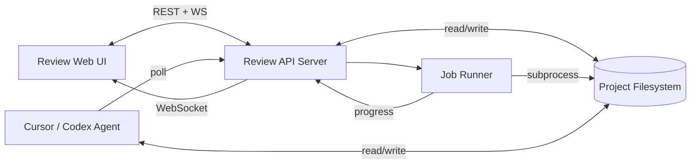

# Video Producer Review Studio — 规划与实施规格

> **文档版本:** 0.3.0  
> **状态:** 已实现（Phase 0–3 MVP + 多项目工作区）  
> **目标读者:** 后续负责实现 Review Studio、审核门禁、Agent 闭环的 AI / 工程师  
> **关联 Skill:** `video-producer`（本仓库）  
> **参考项目:** `opc-ai-douyin-3min`（OPC 抖音 3 分钟 explainer，S001 segment）

---

## 0. 文档目的

本规格定义 Video Producer 工作流的 **人工审核门禁（Human-in-the-Loop Gate）** 与 **Review Studio 网页控制台** 的完整设计，以实现：

1. **每一步产物必须经过人工审核（approve）后，才允许进入下游 stage**
2. **精细化到资产级别**：可标记单个 SVG、单个 beat、单个 scene actor 为不合格
3. **Agent 可消费统一状态**：Cursor / Codex 等 agent 读取 `regen_queue` 与 `review_registry`，只重生成被驳回的部分
4. **网页统一查看、编辑、预览、触发脚本**，而不是在磁盘上散落打开 MD/CSV/MP4

**设计原则（与 SKILL.md 一致）：**

- 中间产物是 **source of truth**（磁盘上的 CSV/JSON/MD/SVG/HTML）
- 脚本只负责：**读上游 approved 产物 → 写下游 draft 产物**
- 不覆盖 `approved` / `locked` 产物；修改时创建 **版本化 draft**（`*.v003.md`、`render_hq.mp4`）
- 网页是 **Orchestrator + Reviewer**，不把生成逻辑塞进前端

**Agent 读取边界（防 token 爆炸）：**

- `review-studio/` 是 **给人用的本地网页控制台**，不是 Agent 制片必读材料。
- 常规 script / research / segment 任务：**不要**读取 `review-studio/web/*`、`review-studio/server/*` 或本规格全文。
- Agent 应读：`PROJECT_DIR/.video/`（`state.json`、`review_registry.jsonl`、`regen_queue.json` 等）+ 项目内 `script/`、`segments/` 等产物；用 `scripts/validate_gates.py`、`review_sync.py`、`regen_dispatch.py` 与审核状态对齐。
- 仅当用户明确要求 **启动/调试 Review Studio** 或 **改 Review Studio 本身** 时，才读 `review-studio/README.md` 或本文件相关章节。

---

## 1. 完整 Pipeline 与 Stage 定义

Video Producer SKILL 定义约 **24 个 workflow mode**。在 `.video/state.json` 中应跟踪以下 **canonical stages**（与 `assets/templates/state.json` 对齐，可扩展 `fact-lock`、`beat-design` 等别名）。

### 1.1 Stage 依赖图（逻辑顺序）

```mermaid
flowchart TB
  subgraph upstream [上游：事实与叙事]
    plan[plan]
    ingest[ingest]
    ref[reference-analysis]
    style[style-match]
    research[research]
    fact[fact-lock]
    script[script / beat-design]
    compiler[director-compiler / asset-choreography]
  end

  subgraph mid [中游：视听设计]
    ad[art-direction / design]
    sb[storyboard]
    shot[shot-design]
    sound[sound-design]
  end

  subgraph exec [下游：生产与交付]
    assets[assets]
    audio[audio-assets]
    seg[segments]
    mix[audio-mix]
    asm[assemble]
    aes[aesthetic-review]
    qc[qc]
    pub[publish]
  end

  plan --> ingest --> ref --> style --> research --> fact --> script --> compiler
  compiler --> ad --> sb --> shot --> sound
  sound --> assets
  sound --> audio
  assets --> seg
  audio --> seg
  seg --> mix --> asm --> aes --> qc --> pub
```

### 1.2 每个 Stage 的：输入 / 输出 / 审核要点 / 可触发脚本

| Stage ID | 主要输出产物 | 人工审核要点 | 常用脚本 / 命令 |
|----------|-------------|-------------|----------------|
| `plan` | `script/creative_brief.md` | 目标受众、时长、平台、是否 factual | `init_video_project.py` |
| `ingest` | `research/input_inventory.md`, `inbox/*` | 素材是否齐全 | — |
| `reference-analysis` | `analysis/reference_video/style_dna.md` | 风格 DNA 是否可执行 | `analyze_reference_video.py` |
| `style-match` | 更新 `design/*`, `script/storyboard.json` | 是否偏离参考过多 | — |
| `research` | `research/source_cards.jsonl`, `research_brief.md` | 来源质量、覆盖面 | — |
| `fact-lock` | `claim_ledger.csv`, `factcheck_report.md` | 每条 claim 可追溯 | `script_claim_lint.py --fail-under 85` |
| `script` | `voiceover.md`, `narration_beats.csv`, `text_manifest.json` | 口播自然度、claim 标注 | — |
| `director-compiler` | `beat_timeline.json`, `director_event_graph.json`, `asset_choreography_manifest.csv` | micro-event 密度、动作语义 | `director_compiler.py`, `beat_timeline_lint.py` |
| `art-direction` | `art_direction.md`, `tokens.json`, `micro_animation_palette.json` | 配色、字体、动效语法 | — |
| `storyboard` | `storyboard.json`, `retention_curve.json` | 段落节奏、视觉隐喻 | — |
| `shot-design` | `shotlist.json`, `beat_director_notes.md` | 镜头与 beat 对齐 | `storyboard_to_shotlist.py` |
| `sound-design` | `tts_plan.json`, `audio_cue_sheet.json`, `audio_mix_plan.json` | SFX 与 beat 绑定 | `beat_timeline_to_audio_cues.py` |
| `assets` | `asset_manifest.csv`, `segments/<id>/assets/*` | 每个 SVG/截图 rights、视觉质量 | — |
| `audio-assets` | `audio/voice/*.wav`, `vo_timing.json`, `micro_timing.json` | 逐 beat 试听、CPS 带 | `edge_tts_generate.py` / `indextts2_generate.py`, `measure_segment_vo.py`, `build_micro_timing.py`, `segment_timing_lint.py` |
| `segments` | `index.html`, `render.mp4`, `timing_qc_report.md` | 画面跟读、HyperFrames lint | `build_*_composition.py`, `hyperframes lint`, `hyperframes render` |
| `audio-mix` | mixed stems, `audio_mix_command.sh` | 响度、BGM 不盖人声 | `ffmpeg_audio_mix.py` |
| `assemble` | `edit/timeline.json`, `edit/captions.srt`, final mp4 | 总时长、字幕对齐 | `build_timeline.py`, `ffmpeg_assemble.py` |
| `aesthetic-review` | `edit/aesthetic_report.md` | 分数 ≥ 阈值 | `aesthetic_score.py --fail-under 72` |
| `qc` | `edit/qc_report.md`, `edit/audio_qc_report.md` | 事实/权利/无障碍 | `validate_project.py`, `douyin_ai_explainer_score.py` |
| `publish` | `exports/publish_pack.md` | 标题、描述、话题 | — |

### 1.3 Stage 状态机

沿用 `scripts/stage_gate.py` 的合法状态：

```
draft → review → approved → locked
         ↑           ↓
    needs-revision ←──┘
```

| 状态 | 含义 | Agent 行为 |
|------|------|-----------|
| `draft` | 产物正在生成或未提交审核 | 可继续编辑同 stage |
| `review` | 产物已就绪，等待人工 | **禁止**跑下游 stage 脚本 |
| `approved` | 人工放行 | 允许跑 **直接下游** stage |
| `needs-revision` | 人工驳回 | 仅修改被指出的 artifact；改完后 → `review` |
| `locked` | 发布级冻结 | **禁止**覆盖；需新版本号 |
| `rendered` | 渲染产物已产出（可选，用于 segment） | 同 review，待 approve |
| `failed` | 脚本/渲染失败 | 修复后 → draft |

**硬规则（须写入 `validate_project.py` 与 agent rule）：**

1. 下游 stage 为 `draft` 时，若任一 **直接依赖** 的上游 stage ≠ `approved|locked`，则 **exit 1**
2. `locked` stage 不可通过 `stage_gate.py` 降级（已有实现）
3. 修改上游文件后，依赖它的下游产物标记为 `stale`（见 §3）

---

## 2. 参考项目 walkthrough（opc-ai-douyin-3min）

用于实现 Review Studio 时的 **集成测试基准项目**。

### 2.1 项目元数据

- **路径示例:** `c:\Users\11839\opc-ai-douyin-3min`
- **Recipe:** `douyin-ai-explainer`
- **比例:** 9:16，1080×1920，~211s
- **Segment:** S001（单段全长）
- **`.video/video.json`:** 标题、平台、 aesthetic_goals.review_required=true

### 2.2 已完成的产物（磁盘存在）

| 领域 | 关键文件 |
|------|---------|
| Research | `research/source_cards.jsonl`, `claim_ledger.csv`, `factcheck_report.md` |
| Script | `script/voiceover.v003.md`, `narration_beats.csv`（35 beats）, `text_manifest.json` |
| Director | `beat_timeline.json`, `director_event_graph.json`, `asset_choreography_manifest.csv` |
| Design | `design/art_direction.md`, `tokens.json`, `micro_animation_palette.json` |
| Storyboard | `storyboard.json`, `shotlist.json`, `beat_director_notes.md` |
| Audio plan | `audio/tts_plan.json`, `audio_cue_sheet.json`, `audio_mix_plan.json` |
| TTS / VO | `audio/voice/S001_vo.wav`, `audio/stems/voice/beats/B001–B035.wav` |
| Segment timing | `segments/S001/vo_timing.json`, `micro_timing.json`, `timing_qc_report.md`（97/100） |
| Visual assets | `segments/S001/assets/*.svg`（15 个）, `scripts/s001_scenes.py` |
| Composition | `segments/S001/index.html`（HyperFrames 兼容）, `scripts/build_s001_composition.py` |
| Render | `segments/S001/render.mp4`（draft, ~58.5MB, ~211s） |
| Edit | `edit/timeline.json`, `edit/captions.srt` |
| QC reports | `edit/aesthetic_report.md`, `edit/qc_report.md`, `edit/audio_qc_report.md` |

### 2.3 已固化的自动化链（segment 为例）

```bash
# 1. TTS（示例：edge-tts fallback）
python scripts/edge_tts_generate.py . --segment S001 --concat --force

# 2. 实测 VO 时长 → micro 事件对齐
python skills/video-producer/scripts/measure_segment_vo.py . S001
python skills/video-producer/scripts/build_micro_timing.py . S001
python skills/video-producer/scripts/segment_timing_lint.py . S001

# 3. 合成 HTML
python scripts/build_s001_composition.py

# 4. HyperFrames
cd segments/S001
npx hyperframes lint .
npx hyperframes render --quality draft --output render.mp4 --fps 30

# 5. Gate
python skills/video-producer/scripts/stage_gate.py . --stage segments --status review --note "draft render ready"
```

### 2.4 已知缺口（Review Studio 要解决的）

1. `.video/state.json` **未完整记录** 上游 stage（仅 audio-assets / segments / assemble）
2. `assets/asset_manifest.csv` **与磁盘不同步**（多项 pending，实际 SVG 已 ready）
3. **无 artifact 级** `review_registry`
4. **无 regen_queue**，agent 驳回后重跑无标准协议
5. 预览分散：HTML、MP4、CSV 无统一 UI

---

## 3. 双层 Gate：Stage + Artifact

### 3.1 Level 1 — Stage Gate（已有，需加强）

**实现位置:** `scripts/stage_gate.py`

**增强需求:**

```python
# validate_project.py 新增逻辑（伪代码）
for stage in DOWNSTREAM_ORDER:
    if stage.status in ("draft", "review") and has_downstream_artifacts(stage):
        warn_or_fail(...)
    for dep in DIRECT_DEPS[stage]:
        if state.stages[dep].status not in ("approved", "locked"):
            errors.append(f"{stage} blocked: {dep} not approved")
```

**CLI 示例:**

```bash
python scripts/stage_gate.py <project> --stage audio-assets --status approved --note "VO CPS OK"
python scripts/stage_gate.py <project> --stage segments --status needs-revision --note "B023 画面太空"
```

### 3.2 Level 2 — Artifact Gate（新增）

每个可审核单元在 `.video/review_registry.jsonl` 中占一行（append-only 日志 + 最新状态索引）。

#### 3.2.1 `review_registry.jsonl` 行格式

```json
{
  "artifact_id": "asset:icon_video",
  "artifact_type": "svg",
  "path": "segments/S001/assets/icon_video.svg",
  "stage": "assets",
  "segment_id": "S001",
  "beat_ids": ["B009", "B023"],
  "actor_ids": ["timeline", "s1"],
  "micro_event_ids": [],
  "status": "review",
  "previous_status": "draft",
  "reviewer": "human",
  "reviewer_note": "",
  "version": 1,
  "content_hash": "sha256:…",
  "depends_on": ["design/tokens.json"],
  "invalidates": [
    "segments/S001/index.html",
    "segments/S001/render.mp4"
  ],
  "updated_at": "2026-06-27T00:00:00+00:00"
}
```

**`status` 枚举:** `draft` | `review` | `approved` | `rejected` | `stale` | `locked`

| status | 含义 |
|--------|------|
| `draft` | 新生成，未提交审核 |
| `review` | 等待人工 |
| `approved` | 可被子节点引用 |
| `rejected` | 人工不合格，触发 regen |
| `stale` | 上游变更导致需重跑 |
| `locked` | 不可变 |

#### 3.2.2 审核粒度（分三期）

| 期 | 粒度 | ID 示例 | 优先级 |
|----|------|---------|--------|
| **P0** | Stage | `stage:audio-assets` | MVP 必须 |
| **P1** | Beat | `beat:B023` | MVP 必须 |
| **P1** | 文件资产 | `asset:browser_window.svg` | MVP 必须 |
| **P2** | Scene Actor | `actor:B013:browser` | 对齐 `data-actor` |
| **P2** | Micro-event | `micro:B023_E02` | 对齐 `micro_timing.json` |
| **P3** | 单行 claim / 字幕 | `claim:C016`, `caption:cap_022` | 可选 |

#### 3.2.3 Stale 传播规则

复用并扩展 `scripts/dependency_report.py` 的 `RULES` 表：

1. 文件变更 → 计算 `impacted` stages
2. 写入 registry：将所有 **下游** artifact 的 status 设为 `stale`（除非 `locked`）
3. 将对应 stage 降回 `review` 或 `needs-revision`

**示例:** 修改 `script/narration_beats.csv` 中 B023 → stale:

- `audio/stems/voice/beats/B023.wav`
- `segments/S001/vo_timing.json`
- `segments/S001/micro_timing.json`
- `segments/S001/index.html`
- `segments/S001/render.mp4`
- stages: `audio-assets`, `segments`, `assemble`, …

---

## 4. Regen Queue — Agent 任务协议

### 4.1 文件：`.video/regen_queue.json`

```json
{
  "version": "1",
  "items": [
    {
      "id": "rq-20260627-001",
      "status": "pending",
      "priority": 1,
      "target_artifact_id": "asset:browser_window.svg",
      "action": "regenerate_svg",
      "assigned_to": "cursor-agent",
      "reason": "窗口太窄，不符合 9:16 布局",
      "context": {
        "segment_id": "S001",
        "beat_ids": ["B013"],
        "actor_id": "browser",
        "scene_key": "scan",
        "source_files": ["scripts/s001_scenes.py", "design/tokens.json"]
      },
      "commands_suggested": [
        "edit segments/S001/assets/browser_window.svg",
        "python scripts/build_s001_composition.py",
        "cd segments/S001 && npx hyperframes lint ."
      ],
      "created_at": "2026-06-27T00:00:00+00:00",
      "completed_at": null
    }
  ]
}
```

**`action` 枚举（可扩展）:**

| action | 说明 |
|--------|------|
| `regenerate_svg` | 重绘单个 SVG |
| `regenerate_beat_tts` | 单 beat TTS |
| `regenerate_segment_html` | 跑 composition builder |
| `regenerate_micro_timing` | measure + build_micro_timing |
| `render_draft` | hyperframes draft render |
| `render_hq` | hyperframes high render |
| `revise_script_beat` | 改 narration_beats 一行并重跑 audio 链 |
| `custom` | `commands_suggested` 由人指定 |

**Queue item 生命周期:** `pending` → `in_progress` → `completed` | `failed`

### 4.2 Agent 契约 — `.video/agent_contract.md`（模板）

实现时复制到每个 video 项目根目录，并加入 Cursor rule / AGENTS.md 引用。

```markdown
# Video Project Agent Contract

## 启动前必读
1. `.video/state.json` — 当前 stage 与各 stage status
2. `.video/review_registry.jsonl` — 最新 artifact status（按 artifact_id 取最后一条）
3. `.video/regen_queue.json` — status=pending|in_progress 的任务

## 禁止
- 修改 status=approved|locked 的文件内容（除非用户显式 unlock）
- 在 upstream stage ≠ approved 时运行下游脚本（如未 approved segment 就 render）
- 跳过 stage_gate 直接写 state.json（必须用 stage_gate.py 或 Review Studio API）

## 允许
- 处理 regen_queue 中 assigned_to 匹配的任务
- 处理 review_registry 中 status=rejected 的 artifact
- 创建版本化 draft：*.v004.md, render_draft_v2.mp4

## 完成后必须
1. 更新 artifact → status=review（不是 approved，除非用户明确说 auto-approve）
2. regen_queue item → completed，附 note
3. append `.video/history.jsonl`
4. 若涉及 VO/beat 变更，重跑 measure → micro_timing → lint
5. 运行 dependency stale 传播

## 命令优先级（segment 视觉驳回）
edit asset → build_composition → hyperframes lint → (人工 review) → render
```

---

## 5. 扩展数据文件

### 5.1 新增文件清单

| 路径 | 用途 |
|------|------|
| `.video/review_registry.jsonl` | Artifact 审核状态日志 |
| `.video/regen_queue.json` | Agent 待办队列 |
| `.video/stage_manifest.json` | 完整 stage 定义 + 必需产物 + 直接依赖（机器可读） |
| `.video/job_log.jsonl` | TTS/render/lint 任务执行记录 |
| `.video/history.jsonl` | 人与 agent 操作审计 |
| `.video/agent_contract.md` | Agent 行为契约 |

### 5.2 `stage_manifest.json` 结构（建议模板）

```json
{
  "version": "1",
  "stages": {
    "audio-assets": {
      "label": "配音与实测时长",
      "depends_on": ["script", "sound-design"],
      "required_artifacts": [
        "audio/voice/{segment}_vo.wav",
        "segments/{segment}/vo_timing.json",
        "segments/{segment}/micro_timing.json"
      ],
      "validation_scripts": [
        "segment_timing_lint.py {project} {segment}"
      ],
      "downstream": ["segments"]
    },
    "segments": {
      "label": "段落合成与渲染",
      "depends_on": ["audio-assets", "assets", "director-compiler"],
      "required_artifacts": [
        "segments/{segment}/index.html",
        "segments/{segment}/timing_qc_report.md"
      ],
      "optional_artifacts": [
        "segments/{segment}/render.mp4"
      ],
      "downstream": ["assemble", "aesthetic-review"]
    }
  }
}
```

**实现任务:** 从 SKILL.md workflow 列表生成完整 manifest，放入 `assets/templates/stage_manifest.json`。

### 5.3 扩展 `assets/asset_manifest.csv` 列

在现有列基础上增加：

```csv
asset_id,type,source,path_or_url,segment_id,role,rights_status,status,review_status,beat_ids,actor_id,version,last_regen_at,notes
```

- `review_status`: 与 registry 同步（`approved` / `rejected` / …）
- `beat_ids`: 逗号分隔，如 `B009,B023`
- `actor_id`: 对应 HTML `data-actor`

---

## 6. Review Studio 网页服务规格

### 6.1 定位

**本地/内网「视频工厂控制台」** — 不替代 Cursor，而是：

- 展示 pipeline 状态与 QC 分数
- 预览 MP4 / HyperFrames / 波形 / SVG
- 编辑 beats、manifest、驳回资产
- 触发后端脚本（子进程）
- 写入 registry / regen_queue / stage_gate

### 6.2 架构



**推荐技术栈（MVP）:**

| 层 | 选型 | 说明 |
|----|------|------|
| API | Python **FastAPI** | 与现有 scripts 同语言，易 subprocess |
| UI | **Vue 3** 或 React + Vite | 表单 + 媒体预览 |
| 实时 | WebSocket | job 进度、agent 写回 |
| 静态媒体 | API `/media/{path}` | 安全路径校验，禁止 path traversal |
| 预览 | iframe → `npx hyperframes preview` 或 `<video>` | 见 §6.4 |

**Repo 内建议路径:**

```
video-producer/
  review-studio/
    server/           # FastAPI app（main.py, workspace.py, jobs.py）
    web/              # 前端 SPA（index.html, app.js）
    shared/schemas/   # JSON Schema for registry, queue
    start.ps1         # Windows 启动脚本
    requirements.txt
  scripts/
    review_sync.py    # manifest ↔ registry ↔ asset_manifest 同步
    validate_gates.py # 上游未 approve 则 fail
    test_review_studio.py  # T1–T8 集成测试
```

**代码与数据分离（重要）：**

- **Skill 仓库只放一份** `review-studio/` + `scripts/`（所有项目共用）
- **每个视频项目只放数据**：`.video/`、`script/`、`segments/` 等
- **不要在** `init_video_project.py` 时复制网页代码到项目目录

### 6.3 页面模块

页头 **工作区栏**（所有 Tab 共用，切换项目无需重启服务）：

| 控件 | 功能 |
|------|------|
| 工作区根目录 + **浏览…** | 系统文件夹对话框选父目录；或手输路径 |
| **扫描** | 扫描工作区下含 `.video/state.json` 的子目录 |
| **当前项目** 下拉 | 切换已发现的项目 |
| 打开路径 + **浏览…** | 直接选单个项目目录并切换 |
| **切换** | 手输绝对路径打开任意项目 |

| 路由 / Tab | 模块 | 功能 |
|------------|------|------|
| `/` Pipeline | Pipeline 总览 | 24 stage 进度、current_stage、blocked 原因 |
| Beats | Beat 工作台 | narration、CPS、duration、inline 编辑、VO 试听 |
| Assets | 资产库 | SVG 网格、Approve/Reject/Queue |
| Timeline | 时间轴 | beat 块 + micro 点；lint/build job |
| Preview | 合成预览 | render.mp4；render blocked 提示 |
| Regen Queue | Agent 待办 | pending 任务列表 |
| QC | QC 面板 | timing/aesthetic/qc 报告 |
| History | 审计日志 | history.jsonl 可读视图 |

### 6.4 预览策略

| 内容类型 | 预览方式 |
|----------|---------|
| `render.mp4` | HTML5 `<video controls>` |
| `*.wav` | Waveform + `<audio>`（可用 wavesurfer.js） |
| `*.svg` | 内联 `` 或 SVG DOM |
| `index.html` | 方案 A: 外链 HyperFrames preview URL；方案 B: API 代理静态服务 + 只读 timeline seek |
| `narration_beats.csv` | 表格内联编辑 + 保存 API |

**HyperFrames 注意:** 合成页须满足 `hyperframes lint` 0 errors（`data-composition-id`, `window.__timelines`, 无 imperative audio play）。Preview 用：

```bash
cd segments/S001 && npx hyperframes preview --port 3017
# UI 嵌入: http://localhost:3017/#project/S001
```

### 6.5 REST API 规格（MVP）

**Base URL:** `http://127.0.0.1:8787/api`

| Method | Path | 说明 |
|--------|------|------|
| GET | `/workspace` | 工作区根目录、扫描深度、项目列表、最近项目、当前项目 |
| PUT | `/workspace/root` | body: `{path, scan_depth?}` 设置工作区并扫描 |
| POST | `/workspace/scan` | 重新扫描当前工作区 |
| POST | `/project/switch` | body: `{path}` 热切换当前项目（无需重启） |
| POST | `/dialog/pick-directory` | 打开系统文件夹选择器（本地服务） |
| GET | `/project` | `video.json` + `state.json` + workspace 摘要 |
| GET | `/segments` | 当前项目 segment 列表 |
| GET | `/stages` | stage_manifest + 各 stage status |
| POST | `/stages/{stage_id}/status` | body: `{status, note}` → 调用 stage_gate 逻辑 |
| GET | `/beats?segment=S001` | 合并 narration_beats + vo_timing |
| GET | `/beats/{beat_id}` | 单 beat 详情 + micro events |
| PATCH | `/beats/{beat_id}` | 更新 narration 等字段 → 触发 stale |
| GET | `/assets?segment=S001&status=rejected` | asset_manifest + registry |
| POST | `/assets/{asset_id}/review` | body: `{status, note}` |
| GET | `/registry` | 最新 artifact 状态列表 |
| GET | `/regen-queue` | 队列 |
| POST | `/regen-queue` | 追加任务 |
| PATCH | `/regen-queue/{id}` | agent 更新 in_progress/completed |
| POST | `/jobs/preset/{name}` | 预设 job：lint / build_composition / validate_gates / review_sync |
| POST | `/jobs/run` | body: `{script, args[], cwd}` |
| GET | `/jobs/{id}` | 状态 + log tail |
| GET | `/timeline?segment=S001` | vo_timing + beats + micro_events |
| GET | `/publish` | 读取 publish_pack.md |
| GET | `/dependency?changed=...` | stale 链 + impacted stages |
| GET | `/media/*path` | 安全文件服务 |
| WS | `/events` | `{type: job_progress\|registry_updated\|state_updated\|project_switched}` |

**路径安全:** `media` 路径必须 resolve 后在 **当前项目** root 内，拒绝 `..`。

### 6.6 关键用户流程

#### 流程 A — 驳回单个 SVG

1. 资产库 → `browser_window.svg` → **Reject**，备注「窗口太窄」
2. API：`review_registry` 追加 rejected；`index.html`、`render.mp4` → stale
3. 用户点击「加入 Regen 队列」
4. Agent 读 queue → 改 SVG / `s001_scenes.py` → `build_s001_composition.py` → artifact → review
5. 用户在 UI **Approve** → 解锁 `hyperframes render` job

#### 流程 B — 修改 B023 口播

1. Beat 详情页编辑 narration 文字 → PATCH API 写 `narration_beats.csv`
2. API 跑 dependency → stale: B023 wav, vo_timing, micro_timing, index, render
3. 用户点击「重跑 audio 链」job：`edge_tts B023` → measure → micro_timing → build HTML
4. 全部变 review；用户逐条或批量 approve

#### 流程 C — Stage 级放行

1. Segment 页预览 draft `render.mp4` + timing QC 97
2. 点击 **Approve segment stage**
3. Assemble 页解锁 HQ render、publish pack

#### 流程 D — 多项目切换

1. 启动 `--workspace D:\videos`  
2. UI 扫描发现 `project-a`、`project-b`  
3. 下拉切到 `project-b` → Pipeline/Beats/Assets 立即显示 B 的数据  
4. Agent 仍通过磁盘读写 `project-b/.video/regen_queue.json`（与 UI 同一项目）

### 6.7 多项目工作区（已实现）

**原则：** 一套 Review Studio 服务管理多个视频项目；切换项目 **不重启** 进程。

#### 项目识别

目录满足以下条件即视为 video 项目：

```
<项目根>/.video/state.json   ← 必须存在
```

#### 启动参数

| 参数 | 说明 |
|------|------|
| `--workspace <dir>` | 工作区根目录；扫描其下子目录（默认深度 2，`--scan-depth` 可调 1–5） |
| `--project <dir>` | 可选；启动时的默认/当前项目 |
| `--port` | 默认 8787 |

```bash
# 推荐：一个工作区，网页内切换
python review-studio/server/main.py --workspace D:\videos --port 8787

# 指定初始项目
python review-studio/server/main.py --workspace C:\Users\11839 --project c:\Users\11839\opc-ai-douyin-3min
```

Windows 快捷脚本：

```powershell
.\review-studio\start.ps1 -Workspace D:\videos
.\review-studio\start.ps1 -Workspace C:\Users\11839 -Project c:\Users\11839\opc-ai-douyin-3min
```

#### 持久化配置

服务器将最近工作区/项目写入：

```
~/.video-producer/studio.json
```

字段：`workspace_root`、`current_project`、`scan_depth`、`recent_projects`（最多 12 条）。

#### 网页切换流程

1. 工作区 **浏览…** 或手输路径 → **扫描** → 填充项目下拉框  
2. 下拉选择项目，或 **打开路径** **浏览…** 直接选项目目录 → **切换**  
3. 所有 Tab 自动刷新；WebSocket 广播 `project_switched`

#### 目录选择器

- API：`POST /api/dialog/pick-directory` — 调用系统原生文件夹对话框（tkinter，仅本地服务）
- UI：工作区与项目路径旁的 **浏览…** 按钮

---

## 7. 脚本改造清单（给实现 AI 的检查表）

### 7.1 已有脚本 — 需增强

| 脚本 | 改造 |
|------|------|
| `stage_gate.py` | 支持 `--require-deps-approved`；写 history.jsonl |
| `validate_project.py` | 检查下游 blocked；registry 与 manifest 一致性 |
| `dependency_report.py` | 输出 JSON；供 API stale 传播调用 |
| `segment_timing_lint.py` | 结果写入 registry 的 lint_score 字段（可选） |
| `init_video_project.py` | 初始化 review_registry、regen_queue、stage_manifest、agent_contract |

### 7.2 新增脚本

| 脚本 | 职责 |
|------|------|
| `scripts/review_sync.py` | 扫描磁盘 → 更新 asset_manifest.review_status；beat/asset 对齐 |
| `scripts/validate_gates.py` | CI 用：任何下游 draft 且上游未 approve → exit 1 |
| `scripts/regen_dispatch.py` | 读 queue，打印 agent 可读任务摘要（或 dry-run 命令） |
| `scripts/test_review_studio.py` | T1–T8 集成测试（含 workspace 切换） |
| `review-studio/server/main.py` | FastAPI 入口 |
| `review-studio/server/workspace.py` | 工作区扫描、项目热切换、studio.json 持久化 |
| `review-studio/server/pick_directory.py` | 系统文件夹选择器 |

### 7.3 项目级 composition builder 约定

参考 `opc-ai-douyin-3min/scripts/build_s001_composition.py`：

- 读 `vo_timing.json` + `narration_beats.csv` + `micro_timing.json`
- 场景定义放 `scripts/s001_scenes.py`（或 generic `scene_registry.py`）
- 输出 HyperFrames 兼容 HTML：
  - `data-composition-id`, `data-width`, `data-height`, `data-start`, `data-duration`
  - `window.__timelines['S001'] = master`
  - 无 `audio.play()` / `requestAnimationFrame` / `performance.now()`
  - ambient 动画 `repeat` 有限次

---

## 8. 什么固化 vs 什么可编辑

| 类别 | 固化（脚本/recipe） | 人工可编辑（文件） | Review Studio 必审 |
|------|---------------------|-------------------|-------------------|
| 流程顺序 | stage_manifest, SKILL | — | Stage 列表 |
| 事实 | claim_lint | claim_ledger, source_cards | research stage |
| 口播 | CPS lint | voiceover.md, narration_beats.csv | 逐 beat |
| 时间轴 | measure_vo, build_micro_timing | beat_timeline.json | timeline 视图 |
| 视觉 | build_composition, scene registry | SVG, s001_scenes.py | 资产库 |
| 渲染 | hyperframes render | quality/fps 参数 | render 对比 |
| 版本 | 不覆盖 approved | *.v00N.md | diff 视图 |

---

## 9. 实施路线图

### Phase 0 — Gate 补实（1–2 天） ✅ 已完成 2026-06-27

**目标:** 即使无网页，agent 也不能跳过审核。

- [x] 补全 `opc-ai-douyin-3min/.video/state.json` 全部 stage
- [x] 添加 `stage_manifest.json` 模板到 skill repo
- [x] 实现 `validate_gates.py` 并接入 `validate_project.py`
- [x] 同步 `asset_manifest.csv` 与磁盘（`review_sync.py`）
- [x] 编写 `agent_contract.md` 模板
- [x] SKILL.md 增加指向本文档的链接

**验收:** ✅ T1 上游 stage=draft 时 `validate_gates.py` exit 1；T2 `stage_gate.py` 写 history.jsonl

### Phase 1 — Review Studio MVP（约 1 周） ✅ 已完成 2026-06-27

**目标:** 浏览器完成查看、驳回、stage approve、触发 lint/build/render。

- [x] FastAPI：`/project`, `/stages`, `/beats`, `/assets`, `/media`
- [x] POST review + stage status
- [x] Job runner：`segment_timing_lint`, `build_composition`, preset jobs
- [x] 简易 SPA：Pipeline + Beat 列表 + Asset 网格 + MP4 播放
- [x] `review_registry.jsonl` 读写

**验收:** ✅ T4 驳回 SVG → registry stale + render blocked；UI 在 `review-studio/web/`

### Phase 2 — 精细化 + Agent 闭环（2–3 周） ✅ 已完成 2026-06-27

- [x] `regen_queue.json` + `regen_dispatch.py`
- [x] Beat 详情 inline 编辑 + stale 传播（PATCH `/api/beats/{id}`）
- [x] Actor 级 registry（`review_sync.py` 扫描 `data-actor`）
- [x] stale 依赖可视化（`/api/dependency`, Timeline 视图）
- [x] WebSocket job 进度（`/api/events`）
- [x] `review_sync.py` 自动扫描

**验收:** ✅ T3 改 B023 → stale 链；T5 regen_queue dry-run

### Phase 3 — 生产化（按需） ✅ MVP 已完成 2026-06-27

- [x] 多 segment 列表 API（`/api/segments`）
- [x] Job preset 队列（lint / build / validate / review_sync）
- [x] publish pack 读取（`/api/publish`）
- [x] **多项目工作区**（`--workspace`、网页热切换、`~/.video-producer/studio.json`）
- [x] **系统目录选择器**（`POST /api/dialog/pick-directory`、UI「浏览…」）
- [ ] 用户认证（若内网多用户）— 未实现，按需

---

## 10. 测试计划（实现 AI 必跑）

以 **`opc-ai-douyin-3min`** 为 fixture。

### 10.1 单元 / 集成

| # | 测试 | 期望 |
|---|------|------|
| T1 | `validate_gates.py` 在上游未 approve 时 | exit 1 |
| T2 | `stage_gate.py` segments→approved | state 更新 + history |
| T3 | PATCH beat narration → API | narration_beats.csv 变更 + stale registry |
| T4 | Reject SVG → registry | index.html、render.mp4 stale |
| T5 | regen_queue pending → agent 脚本 dry-run | 输出建议命令 |
| T6 | Job: segment_timing_lint | 返回 score 97 |
| T7 | Job: build_s001_composition | index.html 更新 |
| T8 | hyperframes lint 0 errors | 合成页合规 |
| T9 | `PUT /workspace/root` + `POST /project/switch` | 扫描到项目且切换成功 |

### 10.2 E2E（手动或 Playwright）

1. 启动 `--workspace <父目录>`，打开 http://127.0.0.1:8787  
2. 工作区 **浏览…** 选目录 → **扫描** → 下拉切换项目  
3. Pipeline 显示当前项目 stage；播放 `render.mp4`  
4. Reject SVG → Queue 出现条目；render 按钮 disabled  
5. 切换到另一项目 → 数据完全切换，无需重启服务  

### 10.3 回归基准

- VO 总时长: `vo_timing.json` → `total_sec` ≈ 211.272
- Beat 数: 35
- Timing QC: ≥ 95
- HyperFrames lint: 0 errors（warnings 可存在）

---

## 11. 与 SKILL.md 的集成

`SKILL.md` 已包含 **Review Studio & human gates** 章节。完整规格见本文档；常用命令：

```bash
pip install -r review-studio/requirements.txt

# 多项目（推荐）
python review-studio/server/main.py --workspace D:\videos --port 8787

# 工作区 + 默认项目
python review-studio/server/main.py --workspace C:\Users\11839 --project c:\Users\11839\opc-ai-douyin-3min

# Windows
.\review-studio\start.ps1 -Workspace D:\videos

python scripts/validate_gates.py <project>
python scripts/review_sync.py <project>
python scripts/regen_dispatch.py <project> --dry-run
python scripts/test_review_studio.py
```

用户手册：`review-studio/README.md`

---

## 12. 附录 A — opc 项目 Beat / Actor 映射示例

`scripts/s001_scenes.py` 中 scene `scan`（B013）actors:

| actor_id | 动画 preset | 说明 |
|----------|-------------|------|
| browser | enterUp | 竞品官网窗 |
| bili | slideRight | B站卡片 |
| douyin | slideRight | 投放卡片 |
| review | slideUp | 评价卡片 |
| cursor | scanMove | 扫描光标 |
| hl | highlightPulse | 高亮框 |

Registry 行示例:

```json
{"artifact_id":"actor:B013:browser","artifact_type":"actor","path":"scripts/s001_scenes.py#scan","beat_ids":["B013"],"actor_ids":["browser"],"status":"review"}
```

---

## 13. 附录 B — 参考命令速查

```bash
# 安装
pip install -r review-studio/requirements.txt

# 启动 Review Studio（多项目）
python review-studio/server/main.py --workspace D:\videos --port 8787
python review-studio/server/main.py --workspace C:\Users\11839 --project c:\Users\11839\opc-ai-douyin-3min

# 初始化新项目
python scripts/init_video_project.py --name "title" --recipe douyin-ai-explainer --ratio 9:16 --root D:\videos\my-project

# Gate
python scripts/validate_gates.py <project>
python scripts/stage_gate.py <project> --stage segments --status review --note "draft ready"
python scripts/stage_gate.py <project> --stage segments --status approved --require-deps-approved

# 同步 registry / Agent 队列
python scripts/review_sync.py <project>
python scripts/regen_dispatch.py <project> --dry-run

# 集成测试
python scripts/test_review_studio.py
```

---

## 14. 变更日志

| 版本 | 日期 | 说明 |
|------|------|------|
| 0.3.0 | 2026-06-27 | 多项目工作区：--workspace、网页热切换、studio.json、系统目录选择器、review-studio/README.md |
| 0.4.0 | 2026-06-27 | Phase 4–7：Audio Lab、Script Lab、Stage Detail、Timeline Editor、timing/artifact API、audio_chain.py、T1–T20 测试 |
| 0.2.0 | 2026-06-27 | Phase 0–3 MVP 实现：gate 脚本、Review Studio FastAPI+SPA、registry/regen_queue、集成测试 |
| 0.1.0 | 2026-06-27 | 初版：Pipeline 梳理、双层 Gate、Review Studio 规格、实施路线与测试计划 |

---
